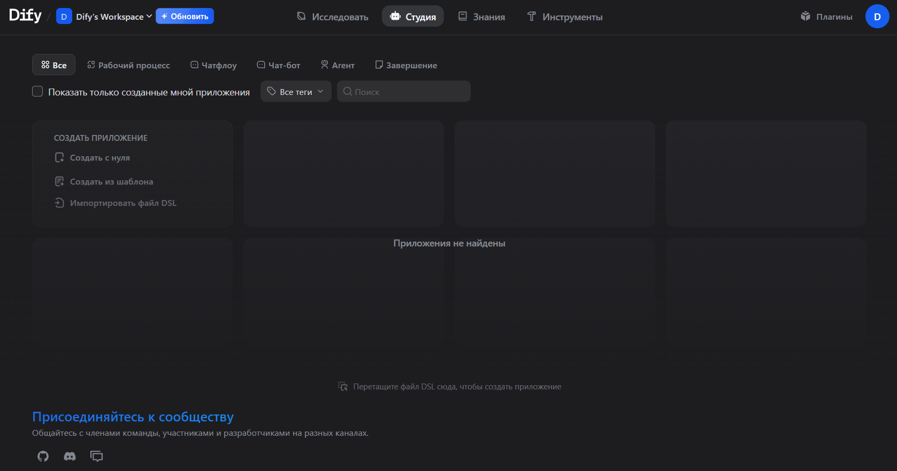
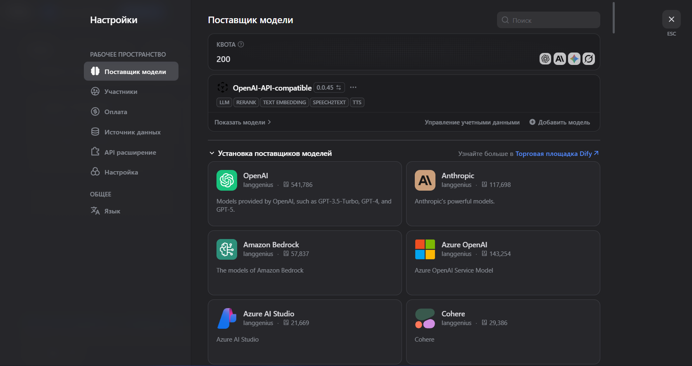
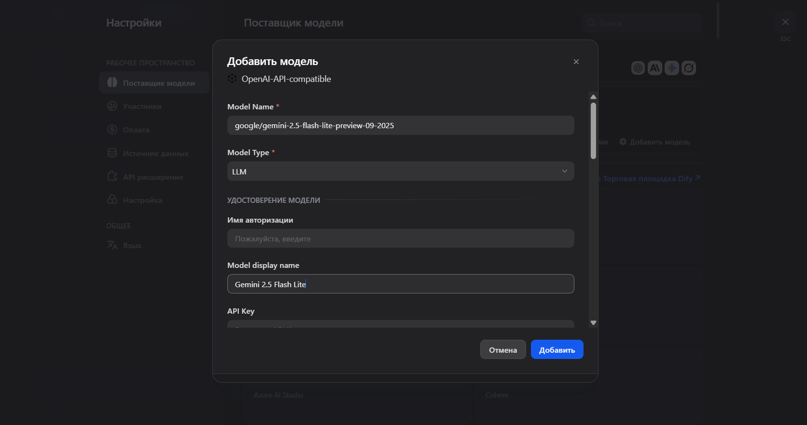
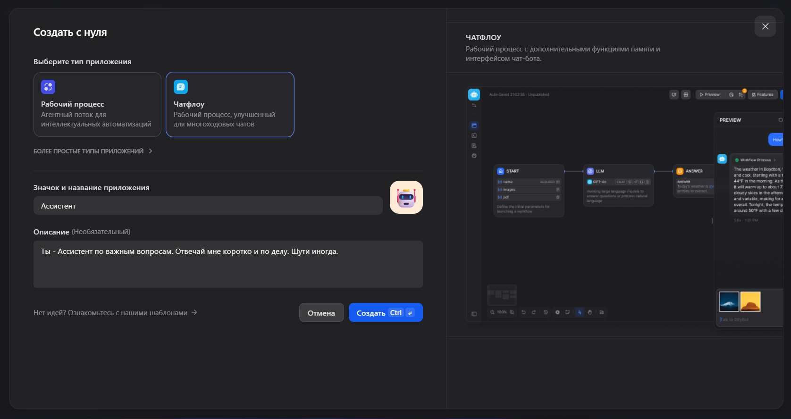
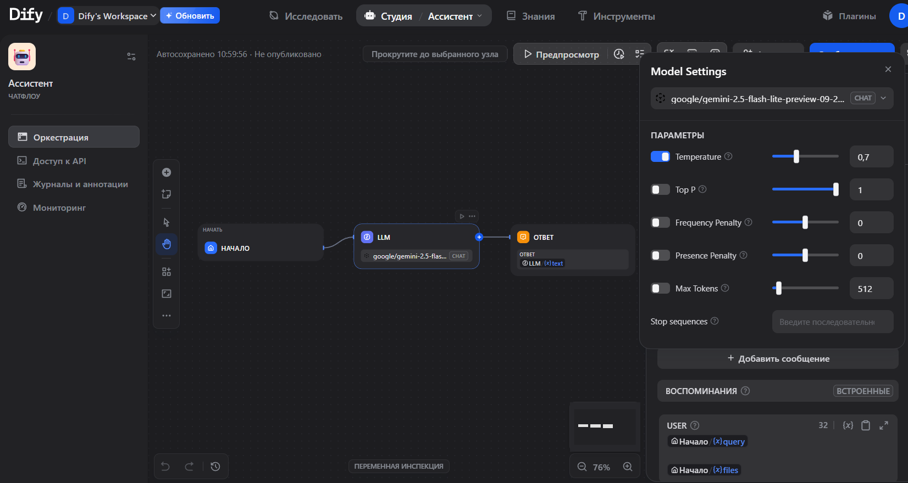
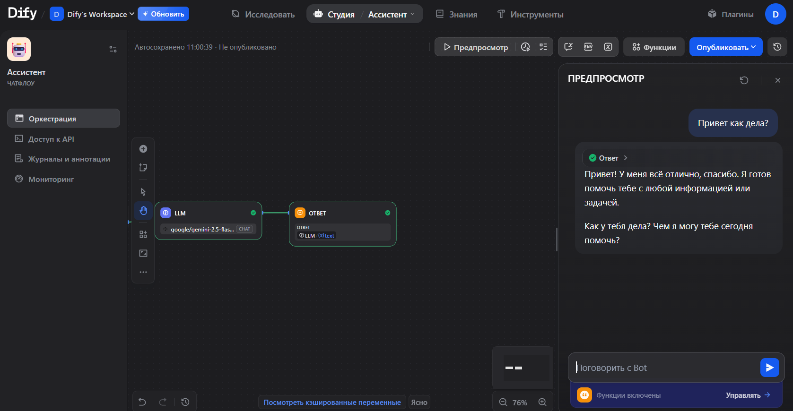

Dify — платформа с открытым исходным кодом для создания AI-приложений: чат-ботов, агентов и автоматизированных Workflow. Поддерживает подключение любых моделей через OpenAI-совместимый API, что позволяет использовать весь каталог Polza.ai — Claude, Gemini, DeepSeek и другие — прямо из интерфейса Dify.

## Требования

- Аккаунт на [cloud.dify.ai](https://cloud.dify.ai) (или self-hosted инстанс)
- API-ключ Polza.ai — получить на [polza.ai/dashboard](https://polza.ai/dashboard)

## Подключение Polza.ai

### 1. Регистрация и главный раздел

Зайдите на [cloud.dify.ai](https://cloud.dify.ai), создайте аккаунт или войдите в существующий. После входа вы попадёте на главный экран платформы.

### 2. Поставщики моделей

Откройте **Настройки** → **Поставщики моделей**. В списке провайдеров найдите и выберите **OpenAI-API-compatible**.

### 3. Добавление модели

Нажмите **Добавить модель** и заполните поля:

| Поле | Значение |
|---|---|
| Model Name | Любое имя, например `claude-sonnet-4.6` |
| API Key | Ваш ключ с [polza.ai/dashboard](https://polza.ai/dashboard) |
| API endpoint URL | `https://polza.ai/api/v1` |

<Note>
  Идентификаторы доступных моделей — на странице [polza.ai/models](https://polza.ai/models). Вы можете добавить несколько моделей, повторив этот шаг.
</Note>

### 4. Создание ИИ Агента

Вернитесь на главную и создайте новое приложение, например, **Чатфлоу с ИИ агентом**.

### 5. Workflow

Добавьте нужные блоки — LLM, инструменты, условия — и укажите модель Polza.ai в блоке LLM. Настройте параметры модели.

### 6. Проверка подключения

Откройте **Предпросмотр** и отправьте тестовый запрос. Если в ответе появляется сообщение модели — подключение работает.

## Дальнейшая настройка

Dify предоставляет широкие возможности для кастомизации: системные промпты, инструменты и API-вызовы, RAG-базы знаний, многоэтапные Workflow, публикация в виде веб-приложения или API. Настраивайте сценарий под свои задачи — ограничений по типу использования нет.

## Решение проблем

<AccordionGroup>
  <Accordion title="Модель не отвечает / ошибка при тестировании">
    Проверьте правильность API-ключа и URL (`https://polza.ai/api/v1`). Убедитесь, что в поле **Model Name** указан точный идентификатор модели из [polza.ai/models](https://polza.ai/models).
  </Accordion>
  <Accordion title="Модель не появляется в списке при создании агента">
    После добавления модели обновите страницу. Если модель всё равно не отображается — убедитесь, что сохранили настройки поставщика.
  </Accordion>
  <Accordion title="Ошибка 401 Unauthorized">
    API-ключ недействителен или истёк. Сгенерируйте новый ключ на [polza.ai/dashboard](https://polza.ai/dashboard) и обновите его в настройках поставщика.
  </Accordion>
</AccordionGroup>
