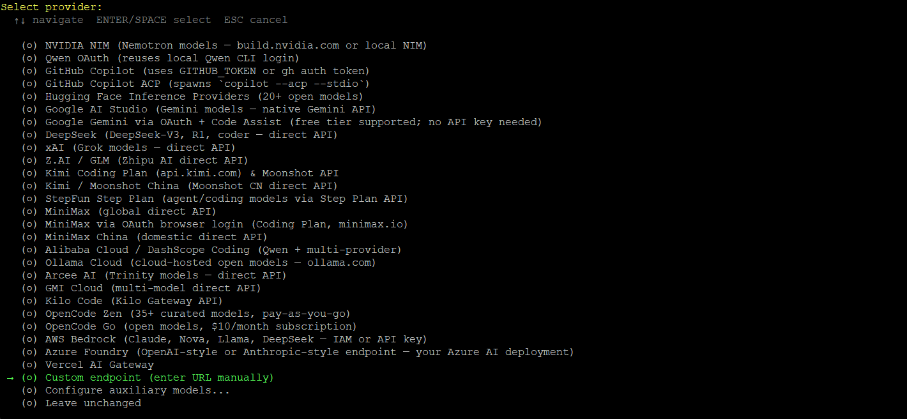
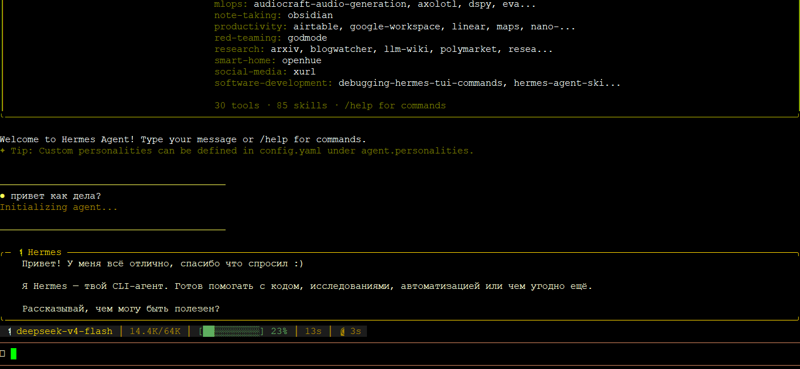
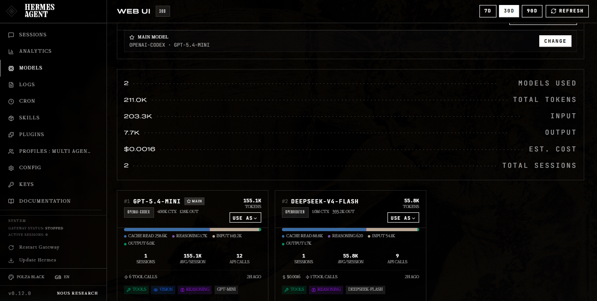

Hermes Agent — AI-агент с открытым исходным кодом от Nous Research. Умеет работать с файлами и терминалом, создаёт навыки из опыта, хранит память между сессиями и общается через Telegram. Подключается к любому OpenAI-совместимому провайдеру — в том числе к Polza.ai.

## Требования

- Linux, macOS, WSL2 или Android (Termux)
- Python 3.11+
- Аккаунт на [polza.ai](https://polza.ai) и API-ключ

## Установка

<Steps>
  <Step title="Установить Hermes Agent">
    Запустите инсталлятор в терминале:

    ```bash
    curl -fsSL https://raw.githubusercontent.com/NousResearch/hermes-agent/main/scripts/install.sh | bash
    ```

    После завершения перезагрузите оболочку:

    ```bash
    source ~/.bashrc   # или source ~/.zshrc
    ```
  </Step>

  <Step title="Запустить мастер настройки">
    ```bash
    hermes setup
    ```

    

    В меню выберите **Custom Endpoint** и следуйте инструкциям:

    | Поле | Значение |
    |---|---|
    | Base URL | `https://polza.ai/api/v1` |
    | API Key | ваш ключ из [личного кабинета](https://polza.ai/dashboard) |
    | Model | `deepseek/deepseek-v4-flash` |
    | Context window | `1000000` (уточняйте в параметрах модели) |

    Остальные параметры можно оставить по умолчанию — просто нажимайте Enter.

    <Note>
      Вместо `deepseek/deepseek-v4-flash` можно указать любую модель, доступную на Polza.ai. Актуальный список — на странице [polza.ai/models](https://polza.ai/models).
    </Note>
  </Step>

  <Step title="Запустить агента">
    ```bash
    hermes
    ```

    

    Откроется интерактивный терминал — можно сразу начинать общаться с агентом.
  </Step>
</Steps>

## Веб-дашборд

Hermes поставляется со встроенным веб-интерфейсом для управления агентом.

Запустите дашборд:

```bash
hermes dashboard
```

По умолчанию он открывается на `http://localhost:9119`. Там можно просматривать сессии, управлять памятью и навыками агента.



<Warning>
  Дашборд хранит API-ключи — не открывайте его на публичный IP без дополнительной защиты. Для удалённого доступа используйте SSH-туннель:

  ```bash
  ssh -L 9119:localhost:9119 user@ваш-сервер
  ```

  После этого откройте `http://localhost:9119` в браузере на локальной машине.
</Warning>

## Подключение Telegram-бота

<Steps>
  <Step title="Создать бота в Telegram">
    Откройте [@BotFather](https://t.me/BotFather) в Telegram и выполните:

    1. Напишите `/newbot`
    2. Придумайте имя бота (например, `My Hermes`)
    3. Придумайте username (должен заканчиваться на `bot`, например `my_hermes_bot`)
    4. Скопируйте выданный токен вида `7123456789:AAHx...`
  </Step>

  <Step title="Узнать свой Telegram ID">
    Напишите боту [@userinfobot](https://t.me/userinfobot) — он пришлёт ваш числовой ID вида `123456789`.
  </Step>

  <Step title="Добавить настройки в .env">
    ```bash
    nano ~/.hermes/.env
    ```

    Добавьте:

    ```env
    TELEGRAM_BOT_TOKEN=ваш_токен_от_BotFather
    TELEGRAM_ALLOWED_USERS=ваш_telegram_id
    ```
  </Step>

  <Step title="Запустить gateway">
    ```bash
    hermes gateway start
    ```

    Теперь напишите своему боту в Telegram — он ответит через Polza.ai.
  </Step>
</Steps>

## Рекомендуемые модели

Hermes Agent — инструмент для агентных сценариев, поэтому модели подбираются с учётом именно агентных задач: длинный горизонт выполнения, множество вызовов инструментов, стабильность при многошаговых сессиях.

| Модель | ID | Для каких агентов |
|---|---|---|
| DeepSeek V4 Flash | `deepseek/deepseek-v4-flash` | Высокопоточные агенты: автоматизация, обработка данных, рутинные задачи. 1M контекст, $0.14/1M токенов — лучшая цена в классе |
| Gemini 3.1 Flash Lite | `google/gemini-3.1-flash-lite-preview` | Агенты с большим числом коротких вызовов: поиск, суммаризация, мониторинг. Быстрый и дешёвый при высоком RPS |
| Kimi K2.6 | `moonshotai/kimi-k2.6` | Долгоживущие автономные агенты: 4000+ вызовов инструментов, сессии 12+ часов, поддержка 300 параллельных суб-агентов. Лидер Terminal-Bench 2.0 среди open-source |
| Qwen 3.5 Plus | `qwen/qwen3.5-plus-20260420` | Агенты для анализа больших кодовых баз и документов: единственная модель в списке с 1M контекстом при умеренной цене |
| GLM-5.1 | `z-ai/glm-5.1` | Агенты для веб-разработки и фронтенда: #3 в Code Arena глобально, лидер SWE-bench Pro среди open-source, MIT-лицензия |
| Claude Opus 4.7 | `anthropic/claude-opus-4.7` | Сложные многоэтапные задачи с нюансами: рефакторинг, аналитика, документы. #1 SWE-bench Pro (64.3%), #1 Vision & Document Arena |
| GPT-5.5 | `openai/gpt-5.5` | Агенты в терминале и CLI-сценарии: лидер Terminal-Bench 2.0 (82.7%), на 40% дешевле GPT-5.4 при том же качестве |

<Note>
  Для большинства пользователей оптимальный старт — **Kimi K2.6** (лучший баланс агентных возможностей и цены) или **DeepSeek V4 Flash** (если важна экономия). Claude Opus 4.7 и GPT-5.5 — для задач, где важнее качество, чем стоимость.
</Note>

Полный список доступных моделей — на странице [polza.ai/models](https://polza.ai/models).

## Решение проблем

<AccordionGroup>
  <Accordion title="hermes: command not found после установки">
    Перезагрузите оболочку:

    ```bash
    source ~/.bashrc   # или source ~/.zshrc
    ```

    Если не помогает, проверьте что `~/.local/bin` есть в `PATH`:

    ```bash
    echo $PATH
    ```
  </Accordion>

  <Accordion title="Ошибка авторизации — Invalid API key">
    Убедитесь что ключ скопирован без лишних пробелов и Unicode-символов. Проверьте содержимое файла:

    ```bash
    cat ~/.hermes/.env | grep OPENAI_API_KEY
    ```

    Если видите лишние символы — перезапишите ключ вручную.
  </Accordion>

  <Accordion title="Бот в Telegram не отвечает">
    Проверьте что gateway запущен:

    ```bash
    hermes gateway status
    ```

    И убедитесь что ваш Telegram ID правильно указан в `TELEGRAM_ALLOWED_USERS` без пробелов и комментариев в той же строке.
  </Accordion>

  <Accordion title="No messaging platforms enabled в логах">
    Убедитесь что `TELEGRAM_BOT_TOKEN` прописан без inline-комментариев:

    ```env
    # Неправильно:
    TELEGRAM_BOT_TOKEN=токен  # comment

    # Правильно:
    TELEGRAM_BOT_TOKEN=токен
    ```
  </Accordion>
</AccordionGroup>
