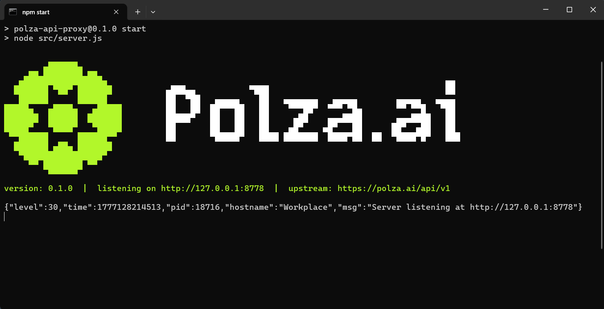

Polza.AI Proxy — локальный OpenAI-совместимый прокси. Принимает запросы от IDE и CLI-инструментов, которые не умеют задавать кастомные параметры, дописывает в них Polza-специфичные поля и прозрачно форвардит на `https://polza.ai/api/v1`.



## Требования

* Node.js 20 или новее
* API-ключ [polza.ai](https://polza.ai/dashboard/api-keys)

## Установка

Клонируйте репозиторий и установите зависимости:

```bash
git clone https://github.com/polza-ai/proxy.git
cd proxy
npm install
```

Зависимость одна — `fastify`, больше ничего не тянется.

## Конфигурация

Скопируйте шаблон и откройте его в редакторе:

```bash
cp config.example.json config.json
```

Минимальный `config.json`:

```json
{
  "port": 8787,
  "host": "127.0.0.1",
  "polzaApiKey": "ваш-api-ключ",
  "inject": {}
}
```

| Поле | По умолчанию | Описание |
| --- | --- | --- |
| `port` | `8787` | Порт локального прокси |
| `host` | `"127.0.0.1"` | Интерфейс. `"0.0.0.0"` — слушать все |
| `polzaApiKey` | `""` | Fallback API-ключ, если клиент не передал свой |
| `inject` | `{}` | Поля, дописываемые в тело каждого запроса |

Если `config.json` нет — при запуске стартует интерактивный мастер настройки.

## Запуск

```bash
npm start
```

При успешном старте — зелёный ASCII-баннер:

```
version: X.Y.Z  |  listening on http://127.0.0.1:8787  |  upstream: https://polza.ai/api/v1
```

## Подключение клиента

В настройках IDE или CLI укажите адрес прокси вместо `https://polza.ai/api`:

```
Base URL: http://127.0.0.1:8787
```

Для Claude Code — в `settings.json`:

```json
{
  "env": {
    "ANTHROPIC_BASE_URL": "http://127.0.0.1:8787",
    "ANTHROPIC_AUTH_TOKEN": "любой-placeholder",
    "ANTHROPIC_API_KEY": ""
  }
}
```

<Note>
Когда ключ задан в `config.json` (`polzaApiKey`), клиент может передавать любой placeholder — прокси подставит ваш ключ сам. Если хотите передавать ключ от клиента, оставьте `polzaApiKey` пустым.
</Note>

## Инъекции

### Выбор провайдера

Задаёт порядок и правила выбора провайдера для каждого запроса. Подробнее — в [документации по выбору провайдера](/docs/gaidy/provider-selection).

```json
{
  "inject": {
    "provider": {
      "order": ["Anthropic", "OpenAI"],
      "allow_fallbacks": true
    }
  }
}
```

Доступные ключи `provider`: `order`, `only`, `allow_fallbacks` — как в документации Polza.

## Проверка

```bash
curl http://127.0.0.1:8787/health
# {"ok":true}
```

Для отладки инъекций — логирование исходящих тел запросов:

```bash
DEBUG_BODIES=1 npm start
```

## Решение проблем

<AccordionGroup>
  <Accordion title="Прокси не запускается или возвращает 502">
    * Проверьте что `polzaApiKey` заполнен в `config.json` — без ключа прокси запустится, но получит 401 от апстрима (предупреждение `⚠ No API key configured` в баннере)
    * Убедитесь что порт `8787` не занят: `lsof -i :8787` (macOS/Linux) или `netstat -ano | findstr 8787` (Windows)
    * Проверьте доступность апстрима напрямую: `curl https://polza.ai/api/v1/models -H "Authorization: Bearer ваш-ключ"`
    * Включите детальное логирование тел запросов: `DEBUG_BODIES=1 npm start`
    * Убедитесь что используется **Node.js ≥ 20**: `node --version`
  </Accordion>
  <Accordion title="Инъекции не применяются">
    * Убедитесь что запрос идёт на один из поддерживаемых эндпоинтов: `/chat/completions`, `/completions`, `/responses`
    * Включите `DEBUG_BODIES=1` и проверьте что уходит на апстрим — поля из `inject` должны быть видны в теле
    * Проверьте что клиент сам не передаёт эти поля — в таком случае прокси не перетирает клиентские значения
  </Accordion>
</AccordionGroup>

## Следующие шаги

<CardGroup cols={2}>
  <Card title="Выбор провайдера" icon="shuffle" href="/docs/gaidy/provider-selection">
    Подробнее о параметрах provider selection
  </Card>
  <Card title="Claude Code" icon="code" href="/integracii/claude-code">
    Подключение Claude Code к Polza.AI
  </Card>
</CardGroup>
