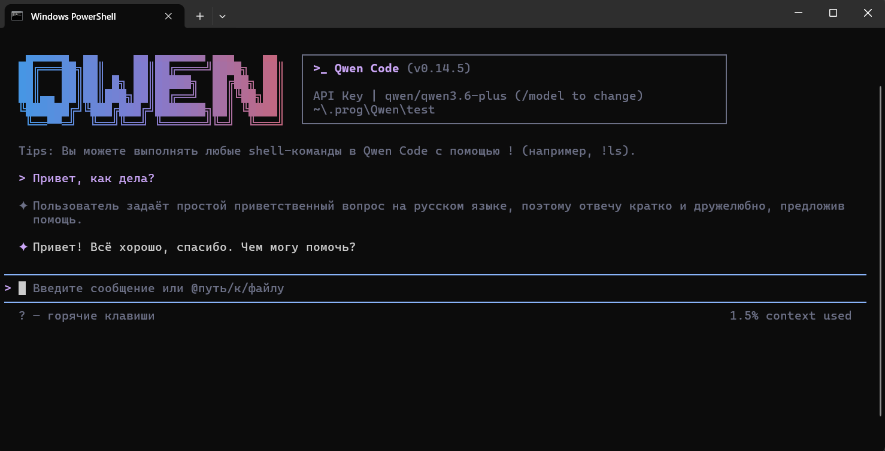
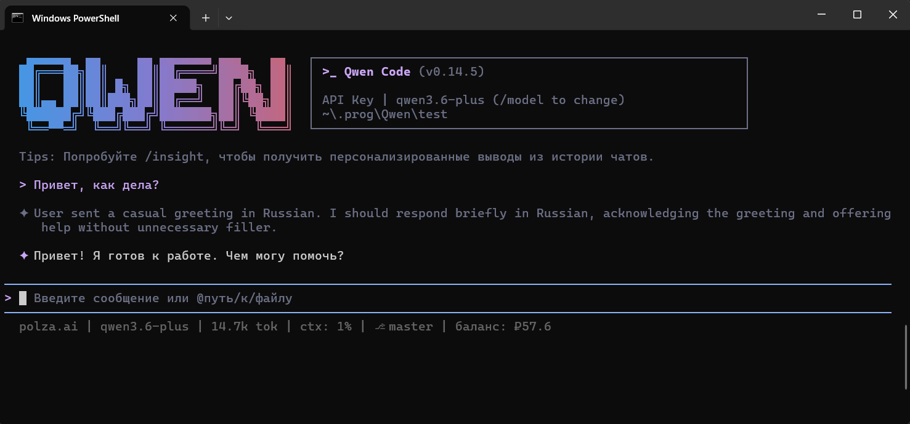

Qwen Code — open-source AI-агент для терминала от команды QwenLM (Alibaba). Аналог Claude Code и Gemini CLI, но для моделей Qwen и любых OpenAI-совместимых провайдеров. Полноценный агентный workflow: читает файлы, пишет код, запускает команды.

## Требования

- Node.js 18 или новее
- macOS, Linux или Windows
- API-ключ [polza.ai](https://polza.ai/dashboard/api-keys)

## Установка Qwen Code CLI

<Tabs>
  <Tab title="Windows">
    Откройте **cmd.exe** и выполните:

    ```cmd
    curl -fsSL -o %TEMP%\install-qwen.bat ^
      https://qwen-code-assets.oss-cn-hangzhou.aliyuncs.com/installation/install-qwen.bat ^
      && %TEMP%\install-qwen.bat
    ```

    <Note>
      После установки перезапустите терминал, чтобы переменные окружения вступили в силу.
    </Note>
  </Tab>
  <Tab title="macOS / Linux">
    ```bash
    npm install -g qwen-code
    ```

    Или через официальный установщик:

    ```bash
    curl -fsSL https://qwen-code-assets.oss-cn-hangzhou.aliyuncs.com/installation/install-qwen.sh | bash
    ```
  </Tab>
</Tabs>

## Подключение к Polza.AI

Конфигурация Qwen Code хранится в файле `~/.qwen/settings.json`. Добавьте Polza.AI как OpenAI-совместимого провайдера и укажите нужные модели:

```json
{
  "modelProviders": {
    "openai": [
      {
        "id": "qwen/qwen3.6-plus",
        "name": "Qwen 3.6 Plus",
        "baseUrl": "https://api.polza.ai/v1",
        "envKey": "OPENAI_API_KEY",
        "generationConfig": {
          "contextWindowSize": 1000000
        }
      },
      {
        "id": "moonshotai/kimi-k2.5",
        "name": "Kimi K2.5",
        "baseUrl": "https://api.polza.ai/v1",
        "envKey": "OPENAI_API_KEY",
        "generationConfig": {
          "contextWindowSize": 262000
        }
      },
      {
        "id": "z-ai/glm-5.1",
        "name": "GLM 5.1",
        "baseUrl": "https://api.polza.ai/v1",
        "envKey": "OPENAI_API_KEY",
        "generationConfig": {
          "contextWindowSize": 203000
        }
      }
    ]
  },
  "env": {
    "OPENAI_API_KEY": "ваш-api-ключ",
    "OPENAI_BASE_URL": "https://api.polza.ai/v1"
  },
  "security": {
    "auth": { "selectedType": "openai" }
  },
  "model": {
    "name": "qwen/qwen3.6-plus"
  },
  "$version": 3
}
```

Замените `ваш-api-ключ` на ключ из [личного кабинета](https://polza.ai/dashboard/api-keys).

<Note>
  Параметр `contextWindowSize` указывает размер контекстного окна модели в токенах. Укажите точное значение для каждой модели — оно влияет на то, как Qwen Code управляет памятью сессии. Актуальные значения можно посмотреть на странице каждой модели в [каталоге](https://polza.ai/models).
</Note>

Запустите Qwen Code из папки проекта:

```bash
cd /path/to/your/project
qwen
```



## Переключение между моделями

Модель по умолчанию задаётся в `model.name`. Переключиться можно при запуске:

```bash
qwen --model qwen/qwen3.6-plus
qwen --model moonshotai/kimi-k2.5
qwen --model z-ai/glm-5.1
```

Полный список доступных моделей — в [каталоге](https://polza.ai/models).

## Статус-бар с расходами сессии

Polza.AI предоставляет кастомный статус-бар для Qwen Code, который выводит информацию о сессии в нижней строке интерфейса.



### Что показывает статус-бар

| Элемент | Пример | Описание |
| --- | --- | --- |
| Провайдер | `polza.ai` | Всегда отображается |
| Модель | `qwen/qwen3.6-plus` | Текущая активная модель |
| Токены | `35.0k tok` | Суммарные токены за сессию (prompt + completion) |
| Кэш | `(cache: 10.0k)` | Кешированные токены (если провайдер поддерживает) |
| Контекст | `ctx: 34%` | Процент заполнения контекстного окна |
| Git-ветка | `⎇ main` | Ветка текущего репозитория |
| Баланс | `баланс: ₽63.6` | Текущий баланс аккаунта Polza.AI |

Баланс обновляется не чаще раза в минуту или после каждого ответа модели.

### Установка

Скрипт написан на Node.js и работает на Linux, macOS и Windows без дополнительных зависимостей (Node.js уже установлен вместе с Qwen Code).

<Tabs>
  <Tab title="Windows">
    Сохраните файл в удобное место, например:

    ```
    C:\Users\ИМЯ\qwen-statusline.mjs
    ```

    Скачать скрипт:

    ```powershell
    curl -fsSL https://cdn.polza.ai/scripts/qwen-statusline.mjs `
      -o $env:USERPROFILE\qwen-statusline.mjs
    ```
  </Tab>
  <Tab title="macOS / Linux">
    ```bash
    curl -fsSL https://cdn.polza.ai/scripts/qwen-statusline.mjs \
      -o ~/.qwen/polza-statusline.mjs
    ```
  </Tab>
</Tabs>

### Подключение

Добавьте блок `ui` в `~/.qwen/settings.json`:

<Tabs>
  <Tab title="Windows">
    ```json
    "ui": {
      "statusLine": {
        "type": "command",
        "command": "node C:\\Users\\ИМЯ\\qwen-statusline.mjs"
      }
    }
    ```
  </Tab>
  <Tab title="macOS / Linux">
    ```json
    "ui": {
      "statusLine": {
        "type": "command",
        "command": "node /home/user/.qwen/qwen-statusline.mjs"
      }
    }
    ```
  </Tab>
</Tabs>

<Note>
  Git-ветка отображается только если папка запуска является git-репозиторием с хотя бы одним коммитом. В свежем репозитории выполните: `git commit --allow-empty -m "init"`
</Note>

## Решение проблем

<AccordionGroup>
  <Accordion title="Ошибка аутентификации (401)">
    - Убедитесь что `OPENAI_API_KEY` содержит ваш ключ Polza.AI
    - Проверьте что `OPENAI_BASE_URL` установлен в `https://api.polza.ai/v1`
    - Ключ можно скопировать в [личном кабинете](https://polza.ai/dashboard/api-keys)
  </Accordion>

  <Accordion title="Модель не найдена (model not found)">
    - Проверьте правильность ID модели в `model.name` (например, `qwen/qwen3.6-plus`)
    - Убедитесь что модель доступна в [каталоге Polza](https://polza.ai/models)
    - ID модели чувствителен к регистру
  </Accordion>

  <Accordion title="Статус-бар не отображается">
    - Убедитесь что путь к скрипту в `command` указан верно и файл существует
    - На Windows используйте двойные обратные слеши в пути: `C:\\Users\\...`
    - Проверьте что Node.js доступен в PATH: `node --version`
  </Accordion>

  <Accordion title="Git-ветка не отображается">
    Ветка показывается только при наличии хотя бы одного коммита в репозитории. После `git init` выполните:

    ```bash
    git commit --allow-empty -m "init"
    ```
  </Accordion>
</AccordionGroup>
